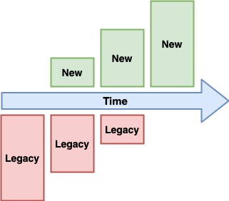
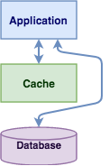
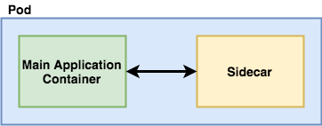
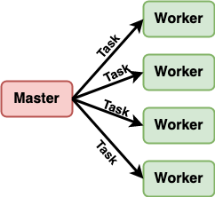
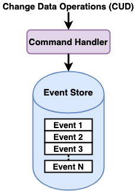
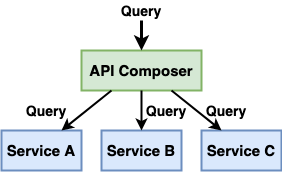
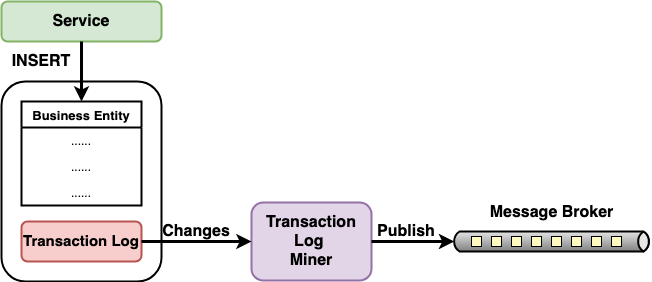
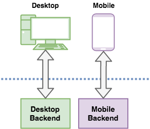

# distributed-system-design-pattern

## Overview
Collect modern distributed system design patterns.

## Categories
- [**Legacy System Pattern**](#legacy-system-patterns)
   - [Anti-Corruption Layer (ACL)](patterns/legacy_system_patterns/Anti_Corruption_Layer.md)
   - [Strangler](patterns/legacy_system_patterns/Strangler.md)
- [**Cache Pattern**](#cache-patterns)
   - [Cache-Aside](patterns/cache_patterns/Cache_Aside.md)
   - Cache-As-SOR
      - [Read-Through](patterns/cache_patterns/Read_Through.md)
      - [Write-Through](patterns/cache_patterns/Write_Through.md)
      - [Write-Behind](patterns/cache_patterns/Write_Behind.md)
      - [Refresh-Ahead](patterns/cache_patterns/Refresh_Ahead.md)
- [**Container Patterns**](#container-patterns)
   - Single-node, multi-container patterns
      - [Sidecar](patterns/container_patterns/Sidecar.md)
         - [Ambassador](patterns/container_patterns/Ambassador.md)
         - [Adapter](patterns/container_patterns/Adapter.md)
   - Multi-node patterns
      - [Leader Election](patterns/container_patterns/Leader_Election.md)
      - [Work Queue](patterns/container_patterns/Work_Queue.md)
      - [Scatter/Gather](patterns/container_patterns/Scatter_Gather.md)
- [**Data Management Patterns**](#data-management-patterns)
   - [Command Query Responsibility Segregation (CQRS)](patterns/data_management_patterns/Command_Query_Responsibility_Segregation.md)
   - [Event Sourcing](patterns/data_management_patterns/Event_Sourcing.md)
   - [API Composition](patterns/data_management_patterns/API_Composition.md)
   - [Database Per Service](patterns/data_management_patterns/Database_Per_Service.md)
   - [Shared Database](patterns/data_management_patterns/Shared_Database.md)
- [**Messaging Patterns**](#messaging-patterns)
   - [Claim Check](patterns/messaging_patterns/Claim_Check.md)
   - [Publishing Events Using Local Transactions](patterns/messaging_patterns/Publishing_Events_Using_Local_Transactions.md)
   - [Transaction Log Tailing](patterns/messaging_patterns/Transaction_Log_Tailing.md)
- [**Resiliency Patterns**](#resiliency-patterns)
   - [Circuit Breaker](patterns/resiliency_patterns/Circuit_Breaker.md)
   - [Bulkhead](patterns/resiliency_patterns/Bulkhead.md)
   - [Fallback](patterns/resiliency_patterns/Fallback.md)
   - [Retry](patterns/resiliency_patterns/Retry.md)
   - [Timeout](patterns/resiliency_patterns/Timeout.md)
- **Security Patterns**
   - [Valet Key](patterns/security_patterns/Valet_Key.md)
- [**Transaction Patterns**](#transaction-patterns)
   - [Two-Phase Commit (2PC)](patterns/transaction_patterns/Two_Phase_Commit.md)
   - [Three-Phase Commit (3PC)](patterns/transaction_patterns/Three_Phase_Commit.md)
   - [Saga](patterns/transaction_patterns/Saga.md)
   - [Try-Confirm/Cancel (TCC)](patterns/transaction_patterns/Try_Confirm_Cancel.md)
- [**External API Patterns**](#external-api-patterns)
   - [API Gateway](patterns/external_api_patterns/API_Gateway.md)
   - [Backends for Frontends (BFF)](patterns/external_api_patterns/Backends_For_Frontends.md)
- [**Configuration Patterns**](#configuration-patterns)
   - [External Configuration Store](patterns/configuration_patterns/External_Configuration_Store.md)
- [**Other Patterns**](#other-patterns)
   - [Health Check API](patterns/other_patterns/Health_Check_API.md)

----

## Brief Introduction
### Legacy System Pattern

| Pattern Name | Diagram | Description |
| ---- | ------ | ---- |
| [*Anti-Corruption Layer (ACL)*](patterns/legacy_system_patterns/Anti_Corruption_Layer.md) |  | Place an adapter layer between 2 domain models and translate communications between them. | 
| [*Strangler*](patterns/legacy_system_patterns/Strangler.md) |  | Incrementally refactor the legacy application to the new application and services. |

### Cache Patterns
#### Cache Pattern Categories
| Category Name | Diagram | Description | Patterns |
|----|----|----|----|
| [*Cache-Aside*](patterns/cache_patterns/Cache_Aside.md) |  | Application interacts with both cache and database (No interaction between cache and database). |  |
| *Cache-As-SOR* |  | Application only interacts with cache. | <ul><li>Read-Through<li>Write-Through<li>Write-Behind<li>Refresh-Ahead</ul> |

#### Cache-As-SOR Patterns
| Pattern Name | Diagram | Description | 
|----|----|----|
| [*Read-Through*](patterns/cache_patterns/Read_Through.md) |  | If requested data is not in cache, cache will load the data from database and let application read **synchronously**. |
| [*Write-Through*](patterns/cache_patterns/Write_Through.md) |  | After application writes data to cache, cache **synchronously** write the same data to database. |
| [*Write-Behind*](patterns/cache_patterns/Write_Behind.md) |  | After application writes data to cache, cache **asynchronously** write the same data to database (When satisfy a certain criteria). |
| [*Refresh-Ahead*](patterns/cache_patterns/Refresh_Ahead.md) |  | Cache automatically and **asynchronously** reloads (refreshs) any recently accessed cache entry from database before its expiration. |

### Container Patterns
| Pattern Name | Diagram | Description |
|----|-------|----|
| [*Sidecar*](patterns/container_patterns/Sidecar.md) |  | <ul><li>Place an independent sidecar container next to the main application container for providing supportive works to the main application container.</ul> |
| [*Ambassador*](patterns/container_patterns/Ambassador.md) |  | <ul><li>Place an ambassador container between the main application container and the external system for simplifying the view of the external system.</ul> |
| [*Adapter*](patterns/container_patterns/Adapter.md) |  | <ul><li>Place an adapter container between the main application container and the external system for standardizing the view of the internal application.</ul> |
| [*Leader Election*](patterns/container_patterns/Leader_Election.md) |  | <ul><li>Elect one instance as the leader for coordinating and monitoring the other instances.</ul> |
| [*Work Queue*](patterns/container_patterns/Work_Queue.md) |  | <ul><li>Group a work queue manager container and a work queue source container as a coordinator for managing the work queue and dispatch work items to workers.<li>Each worker consists of a worker manager container (for integrating with the generic work queue framework) and an application implementation container (for application-specific logic).</ul> |
| [*Scatter/Gather*](patterns/container_patterns/Scatter_Gather.md) |  | <ul><li>The root node scatters out the original request to a group of servers to perform a set of tasks in parallel.<li>The root node gathers the partial data from each server and return a single response to the original request.</ul>

### Data Management Patterns
| Pattern Name | Diagram | Description |
| ---- | ------ | ---- |
| [*Command Query Responsibility Segregation (CQRS)*](patterns/data_management_patterns/Command_Query_Responsibility_Segregation.md) |  | Use separated models for different types of operations: Command (update data) and Query (read data). |
| [*Event Sourcing*](patterns/data_management_patterns/Event_Sourcing.md) |  | Use a sequence of events to capture a series of changes to data. |
| [*API Composition*](patterns/data_management_patterns/API_Composition.md) |  | Use an API composer to retrieve data from multiple services and combine the results for query operations. |
| [*Database Per Service*](patterns/data_management_patterns/Database_Per_Service.md) |  |  |
| [*Shared Database*](patterns/data_management_patterns/Shared_Database.md) |  |  |

### Messaging Patterns
| Pattern Name | Diagram | Description |
| ---- | ------ | ---- |
| [*Claim Check*](patterns/messaging_patterns/Claim_Check.md) |  | When sending a large message from one service to another, store the large message into a data store, only send the reference as the claim check to the receiver service for retrieving the large message from the data store. |
| [*Publishing Events Using Local Transactions*](patterns/messaging_patterns/Publishing_Events_Using_Local_Transactions.md) |  | <li>Uses the event table to store the events need to be published.<li>Bundles the operation of inserting new record into a business entity table and the operation of inserting a new event to the event table as a single local database transaction.<li>Event publisher publishes events by polling the event table periodically. |
| [*Transaction Log Tailing*](patterns/messaging_patterns/Transaction_Log_Tailing.md) |  | <li>Publish messages by tailing the database’s transaction log.<li>A transaction log miner reads the transaction log and publish each change as a message to the message broker. |

### Resiliency Patterns
| Pattern Name | Description |
| ---- | ---- |
| [*Circuit Breaker*](patterns/resiliency_patterns/Circuit_Breaker.md) |Detects failures and prevents a failure from constantly recurring. |
| [*Bulkhead*](patterns/resiliency_patterns/Bulkhead.md) | Isolate the misbehaving service and avoid to take down the entire application by exhausting all the resources. |
| [*Fallback*](patterns/resiliency_patterns/Fallback.md) | When a request to a service fails, return an alternative response to the request. |
| [*Retry*](patterns/resiliency_patterns/Retry.md) | Retry a falling operation. |
| [*Timeout*](patterns/resiliency_patterns/Timeout.md) | Set a limited period of time to wait for a response. |

### Transaction Patterns
| Pattern Name | Diagram | Description |
| ---- | ------ | ---- |
| [*Two-Phase Commit (2PC)*](patterns/transaction_patterns/Two_Phase_Commit.md) |  | The coordinator uses 2 phases (prepare phase and commit phase) to coordinates participants on whether to commit or abort (roll back) a distributed transaction. |
| [*Three-Phase Commit (3PC)*](patterns/transaction_patterns/Three_Phase_Commit.md) |  | <li>Add a new phase (prepared to commit phase) in the middle of the original 2 phases in 2PC.<li>Provide a dependable recovery solution if a participant failure or both coordinator and participant failure during commit phase. |
| [*Saga*](patterns/transaction_patterns/Saga.md) |  | <ul><li>A sequence of asynchronous local transactions.<li>Each service<ul><li>Starts its action by getting a event/message from the previous service.<li>Sends a event/message to the next service when it completes its action.</ul><li>If one action fails, executes compensating transactions to rollback the changes.</ul> |
| [*Try-Confirm/Cancel (TCC)*](patterns/transaction_patterns/Try_Confirm_Cancel.md) |  | <li>Use 2 phases (try phase and confirm phase) to change a state.<li>Add an intermediate state (pending state or reserved state) in the middle of those 2 phases. |

### External API Patterns
| Pattern Name | Diagram | Description |
| ---- | ------ | ---- |
| [*API Gateway*](patterns/external_api_patterns/API_Gateway.md) |  | Implement a service that’s the entry point into the microservices-based application for external API clients. |
| [*Backends for Frontends (BFF)*](patterns/external_api_patterns/Backends_For_Frontends.md) |  | Separate backend services for different frontend applications or interfaces. |

### Configuration Patterns
| Pattern Name | Diagram | Description |
|----|-------|----|
| [*External Configuration Store*](patterns/configuration_patterns/External_Configuration_Store.md) | | Externalize all application configuration properties to a centralized location. |

### Other Patterns
| Pattern Name | Diagram | Description |
|----|-------|----|
| [*Health Check API*](patterns/other_patterns/Health_Check_API.md) | | A service exposes a health check API endpoint which returns the health of the service. |
