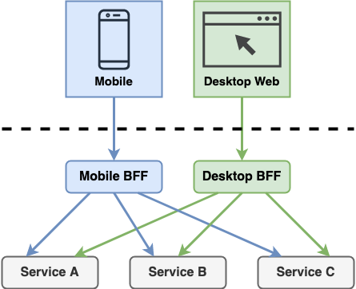

# Backends For Frontends (BFF)

- [**Motivation**](#motivation)
- [**Solution**](#solution)
   - [Concepts](#concepts)
   - [Implementation](#implementation)
- [**Pros & Cons**](#pros--cons)
   - [Pros](#pros)
   - [Cons](#cons)
- [**Consideration**](#consideration)
- [**When To Use**](#when-to-use)
- [**References**](#references)

## Motivation
- The requirements are significantly different for serving different frontends.
- One generic backend has too much logic.
- One generic backend needs to be managed by separate teams.

## Solution
### Concepts

- Restricts the use of backends (BFFs) to one specific user interface or application.

### Implementation
- A single call in to a BFF results in multiple downstream calls to microservices.
- Number of BFFs
   - Options
      - One BFF per type of client. For example, Android and iOS will have different BFFs.
      - One BFF per type of user interface. For example, Android and iOS will have the single mobile BFF.
   - Recommendation
      - BFFs should align around team boundaries. Team structure should drive how many BFFs you have. It can reduce the chance of cross-team coordination.
- BFFs should only contain client-specific logic and behavior. General business logic and other global features should be managed elsewhere in your application.

## Pros & Cons
### Pros
- Each BFF is smaller, less complex and faster than one generic backend.
- Each BFF is isolated from others.
   - Each BFF can have different processes.
   - Each BFF is independently scalable.
   - Each BFF can be released independently.

### Cons

## Consideration
| Topic | Consideration | Possible Solution Options |
|----|-----|-----|
| Code Reusability | Code duplication across BFFs is highly likely | <li>Consider to use the same technology stack for all BFFs. <li>Consider to extract common functionalities into a shared library so that all the BFFs can use them.<li>Consider to extract common functionalities into a new standalone service. |

## When To Use
The application needs to provide specific functionality for a mobile UI or third party.

## References
- Book: [Chris R.(2018). Chapter 8 External API patterns, *Microservices Patterns* (pp. 253-291). Manning Publications](https://www.manning.com/books/microservices-patterns)
- Book: [Sam N.(2015). CHAPTER 4 Integration, *Building Microservices* (pp. 39-78). O'Reilly Media](http://shop.oreilly.com/product/0636920033158.do)
- Web Article: [The Back-end for Front-end Pattern (BFF) | https://philcalcado.com/2015/09/18/the_back_end_for_front_end_pattern_bff.html](https://philcalcado.com/2015/09/18/the_back_end_for_front_end_pattern_bff.html)
- Web Article: [Backends for Frontends pattern | https://docs.microsoft.com/en-us/azure/architecture/patterns/backends-for-frontends](https://docs.microsoft.com/en-us/azure/architecture/patterns/backends-for-frontends)
- Web Article: [Pattern: Backends For Frontends | https://samnewman.io/patterns/architectural/bff/#](https://samnewman.io/patterns/architectural/bff/#)
- Web Article: [BFF @ SoundCloud | https://www.thoughtworks.com/insights/blog/bff-soundcloud](https://www.thoughtworks.com/insights/blog/bff-soundcloud)
