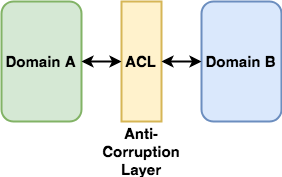

# Anti-Corruption Layer (ACL)

- [**Motivation**](#motivation)
- [**Solution**](#solution)
   - [Concepts](#concepts)
   - [Implementation](#implementation)
- [**Pros & Cons**](#pros--cons)
   - [Pros](#pros)
   - [Cons](#cons)
- [**Consideration**](#consideration)
- [**When To Use**](#when-to-use)
- [**References**](#references)

## Motivation
- When systems based on different models are combined, the need for the new system to adapt to the semantics of the other system can lead to a corruption of the new system’s own model.

## Solution
### Concepts

- Place an adapter layer between 2 domain models and translate communications between them.

### Implementation
- General advices
   - The anti-corruption layer can be implemented as a component within the application or as an independent service.
   - The anti-corruption layer can be bidirectional.

## Pros & Cons
### Pros
- Improve the isolation between the 2 domain models.

### Cons
- May add latency to calls made between the 2 domain models.

## Consideration
| Topic | Consideration | Possible Solution Options |
|----|-----|-----|

## When To Use
Two or more domain models have different semantics, but still need to communicate.

## References
- Book: [Chris R.(2018). Chapter 13 Refactoring to microservices, *Microservices Patterns* (pp. 428-471). Manning Publications](https://www.manning.com/books/microservices-patterns)
- - Web Article: [Anti-Corruption Layer pattern | https://docs.microsoft.com/en-us/azure/architecture/patterns/anti-corruption-layer](https://docs.microsoft.com/en-us/azure/architecture/patterns/anti-corruption-layer)
