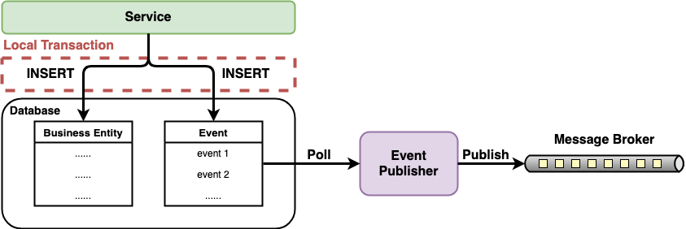

# Publishing Events Using Local Transactions

- [**Motivation**](#motivation)
- [**Solution**](#solution)
   - [Concepts](#concepts)
   - [Implementation](#implementation)
- [**Pros & Cons**](#pros--cons)
   - [Pros](#pros)
   - [Cons](#cons)
- [**Consideration**](#consideration)
- [**When To Use**](#when-to-use)
- [**References**](#references)

## Motivation
- How to update the database and publish a message (event) atomically (either all success, or all fail).
- Cannot use distributed transaction pattens to solve this problem.
   - Many modern message brokers don’t support distributed transactions.

## Solution
### Concepts

- Uses the event table to store the events need to be published.
- Bundles the operation of inserting new record into a business entity table and the operation of inserting a new event to the event table as a single local database transaction.
- Event publisher publishes events by polling the event table periodically.

### Implementation

## Pros & Cons
### Pros
- The atomicity of updating the database and publishing a message (event) is guaranteed.

### Cons
- Frequently polling the database can be expensive.
- Tricky to publish events in order.
- Not all NoSQL databases support this pattern.

## Consideration
| Topic | Consideration | Possible Solution Options |
|----|-----|-----|
| Error handling | The event publisher may publish a event more than once (For example, crash after publishing an event but before marking the corresponding event record as published). | <li>Consider to let the event consumer be idempotent by recording the IDs of the events that it has already processed. |

## When To Use

## References
- Book: [Chris R.(2018). Chapter 3. Interprocess communication in a microservice architecture, *Microservices Patterns* (pp. 65-109). Manning Publications](https://www.manning.com/books/microservices-patterns)
- Book: [Kasun I., Prabath S.(2018). Chapter 5: Data Management, *Microservices for the Enterprise* (pp. 125-150). Apress](https://www.apress.com/gp/book/9781484238578)
- Web Article: [Pattern: Transactional outbox | https://microservices.io/patterns/data/transactional-outbox.html](https://microservices.io/patterns/data/transactional-outbox.html)
- Web Article: [Event-Driven Data Management for Microservices | https://www.nginx.com/blog/event-driven-data-management-microservices/](https://www.nginx.com/blog/event-driven-data-management-microservices/)
