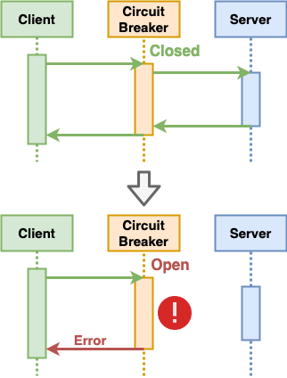

# Circuit Breaker

- [**Motivation**](#motivation)
- [**Solution**](#solution)
   - [Concepts](#concepts)
   - [Implementation](#implementation)
      - [Basic mechanism](#basic-mechanism)
      - [States](#states)
      - [Self-resetting](#self-resetting)
- [**Pros & Cons**](#pros--cons)
   - [Pros](#pros)
   - [Cons](#cons)
- [**Consideration**](#consideration)
- [**When To Use**](#when-to-use)
- [**References**](#references)

## Motivation

## Solution
### Concepts
- Detects failures and prevents a failure from constantly recurring.

### Implementation
#### Basic mechanism

- Adds circuit breaker in the middle of a client and service.
- Circuit breaker monitors failures by tracking the number of failures.
- Once the error rate exceeds some threshold, the circuit breaker will trip so that all further calls fail immediately.

#### States

- Circuit breaker retains a state over a series of calls, there are 3 common value:
   - *Closed*: This is the default value. Circuit breaker doesn't intervene calls except counting the number of failures.
   - *Open*: Once the error rate exceeds some threshold, the circuit breaker's state will be changed to this value and all further calls will be failed immediately. Internal timer will start for changing the state from "Open" to "Half open" when timeout.
   - *Half open*: Circuit breaker accepts part of calls. If all those accepted calls are successful, the circuit breaker will change the state to "Closed" and will all the calls as normal. If one of accepted calls fails, the circuit breaker will change the state to "Open" and block all the calls.
   
#### Self-resetting
- Needs an external intervention to reset the circuit breaker when things are well again.

## Pros & Cons
### Pros
- Prevents a failure from constantly recurring.
### Cons
- Negatively affects on performance.

## Consideration
| Topic | Consideration | Possible Solution Options |
|----|-----|-----|

## When To Use

## References
