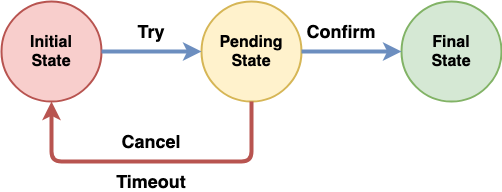

# Try-Confirm/Cancel (TCC)

- [**Motivation**](#motivation)
- [**Solution**](#solution)
   - [Concepts](#concepts)
   - [Implementation](#implementation)
- [**Pros & Cons**](#pros--cons)
   - [Pros](#pros)
   - [Cons](#cons)
- [**Consideration**](#consideration)
- [**When To Use**](#when-to-use)
- [**References**](#references)

## Motivation

## Solution
### Concepts

- Use 2 phases (try-phase and confirm-phase) to change a state.
- Add an intermediate state (pending state or reserved state) in the middle of those 2 phases.

### Implementation

## Pros & Cons
### Pros
- Make cancellation trivial and put more focus on the happy path (try-phase).
- Participating services have increased autonomy.
- No combinatorial explosion or error path complexity.

### Cons

## Consideration
| Topic | Consideration | Possible Solution Options |
|----|-----|-----|
| Interoperability risk | Two services need to communicate and both are out of your control. | <li>Always control at least one service of each communication. |

## When To Use
- Reservation-style business models.

## References
- Web Article: [Eventual Data Consistency Solution in ServiceComb - part 3 | https://servicecomb.apache.org/docs/distributed_saga_3/#:~:text=Try%2DConfirm%2FCancel%20(TCC),with%20reserved%20state%20into%20database](https://servicecomb.apache.org/docs/distributed_saga_3/#:~:text=Try%2DConfirm%2FCancel%20(TCC),with%20reserved%20state%20into%20database)
- Web Article: [Transactions for the REST of Us | https://www.infoq.com/presentations/Transactions-HTTP-REST/](https://www.infoq.com/presentations/Transactions-HTTP-REST/)
