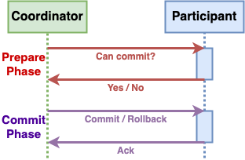

# Two-Phase Commit (2PC)

- [**Motivation**](#motivation)
- [**Solution**](#solution)
   - [Concepts](#concepts)
   - [Implementation](#implementation)
   - [Optimizations](#optimizations)
- [**Pros & Cons**](#pros--cons)
   - [Pros](#pros)
   - [Cons](#cons)
- [**Consideration**](#consideration)
- [**When To Use**](#when-to-use)
- [**References**](#references)

## Motivation

## Solution
### Concepts

The coordinator uses 2 phases to coordinates participants on whether to commit or abort (roll back) a distributed transaction: 
- **Prepare Phase (Commit-Request, Voting Phase)**
   - The coordinator sends a request-to-prepare message to all participants.
   - Each participant prepare the transaction and send back the aggreement message (success) or the abort message (fail) to the the coordinator.
- **Commit Phase (Completion Phase)**
   - **Success**: If the coordinator received an agreement message from all participants:
      - The coordinator sends a commit message to all the participants.
      - Each participant commits the transcation and releases all the locks.
      - Each participant sends an acknowledgement to the coordinator.
   - **Failure**: If any participant sent a abort message to the coordinator:
      - The coordinator sends a rollback message to all the participants.
      - Each participant undos the transaction and release all the locks.
      - Each participant sends an acknowledgement to the coordinator.

### Implementation
### Optimizations
- **Presumed Abort and Presumed Commit**:
   - An assumption about the outcome of transactions, either commit, or abort, can save both messages and logging operations by the participants during the 2PC protocol's execution.
- **Tree 2PC**:
   - The participants in a distributed transaction are typically invoked in an order which defines a tree structure, the invocation tree.
   - In invocation tree, the participants are the nodes and the edges are the invocations (communication links).

## Pros & Cons
### Pros
- It is very strong consistency protocol.

### Cons
- It is a blocking protocol (The protocol will need to lock the object that will be changed before the transaction completes).

## Consideration
| Topic | Consideration | Possible Solution Options |
|----|-----|-----|

## When To Use

## References
- Web Article: [Two-phase commit protocol | https://en.wikipedia.org/wiki/Two-phase_commit_protocol](https://en.wikipedia.org/wiki/Two-phase_commit_protocol)
- Web Article: [Patterns for distributed transactions within a microservices architecture | https://developers.redhat.com/blog/2018/10/01/patterns-for-distributed-transactions-within-a-microservices-architecture/](https://developers.redhat.com/blog/2018/10/01/patterns-for-distributed-transactions-within-a-microservices-architecture/)
